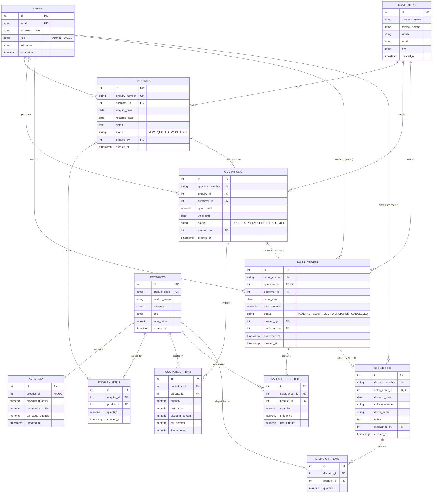

# Industrial ERP - Database Schema & ER Diagram

This document describes the PostgreSQL relational database architecture designed for the Industrial Manufacturing & Supply ERP system.

## Entity-Relationship (ER) Diagram

---

## Relational Constraints & Business Rules

1. **Unique Constraints**:
   - `users.email` is UNIQUE.
   - `products.product_code` is UNIQUE.
   - `enquiries.enquiry_number` is UNIQUE.
   - `quotations.quotation_number` is UNIQUE.
   - `sales_orders.order_number` is UNIQUE.
   - `sales_orders.quotation_id` is UNIQUE: **Guarantees at database level that the same quotation cannot generate duplicate Sales Orders.**
   - `dispatches.dispatch_number` is UNIQUE.
   - `dispatches.sales_order_id` is UNIQUE: **Guarantees duplicate dispatch of the same order is impossible.**

2. **Foreign Key Integrity**:
   - Deletion of Customers or Products referenced by existing transactions is restricted (`ON DELETE RESTRICT`).
   - Cascade deletes apply only to direct child line items (`enquiry_items`, `quotation_items`, `sales_order_items`, `dispatch_items`).

3. **Check Constraints**:
   - `inventory`: `CHECK (physical_quantity >= 0)`
   - `inventory`: `CHECK (reserved_quantity >= 0)`
   - `inventory`: `CHECK (damaged_quantity >= 0)`
   - `inventory`: `CHECK (reserved_quantity + damaged_quantity <= physical_quantity)`: **Prevents negative available inventory at database level.**
   - `quotation_items`: `CHECK (discount_percent >= 0 AND discount_percent <= 100)`
   - `quotation_items`: `CHECK (gst_percent >= 0 AND gst_percent <= 100)`
   - `quotation_items`: `CHECK (unit_price >= 0)`
